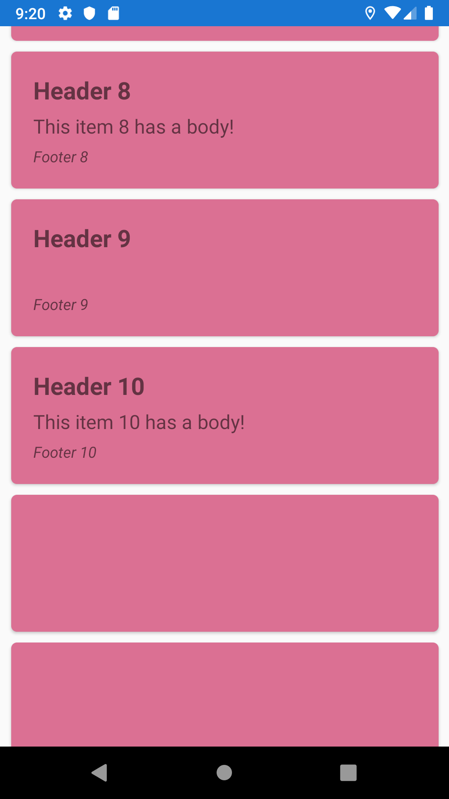

# Issue - ListView with RetainElement

Reproduction example for an issue with ListViews on Xamarin Forms 4.0.0.540366 when `CachingStrategy=RetainElement`. Changing to `CachingStrategy=RecycleElement` fixes the issue, tested Android & iOS, only present in Android.

The content of some cells "disappears" when scrolling through the list.

